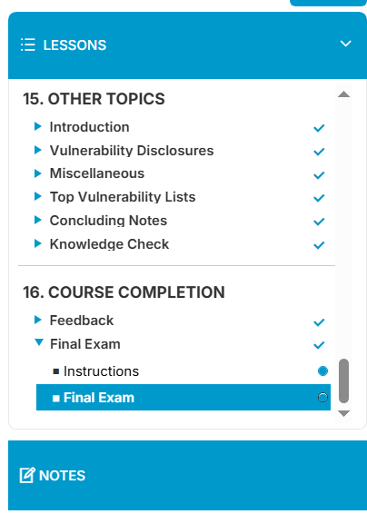
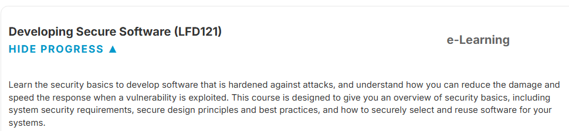

# 🛡️ Developing Secure Software – Linux Foundation (LFD121)

This repository contains **notes, labs, handbook checklists, docs, extras, and a certificate of completion** for the  
*Developing Secure Software (LFD121)* course by **Linux Foundation**.  
The program teaches learners how to **design, develop, test, deploy, and maintain secure software** following industry standards.

---

## 📚 Notes
- 📄 [01-introduction.md](./notes/01-introduction.md) – Course introduction  
- 📄 [02-secure-software-lifecycle.md](./notes/02-secure-software-lifecycle.md) – Secure software lifecycle  
- 📄 [03-requirements-security.md](./notes/03-requirements-security.md) – Security requirements  
- 📄 [04-threat-modelling.md](./notes/04-threat-modelling.md) – Threat modeling  
- 📄 [05-secure-design-principles.md](./notes/05-secure-design-principles.md) – Secure design principles  
- 📄 [06-secure-coding-practices.md](./notes/06-secure-coding-practices.md) – Secure coding practices  
- 📄 [07-dependency-management.md](./notes/07-dependency-management.md) – Dependency & supply chain security  
- 📄 [08-static-analysis-sast.md](./notes/08-static-analysis-sast.md) – Static analysis (SAST)  
- 📄 [09-dynamic-analysis-dast.md](./notes/09-dynamic-analysis-dast.md) – Dynamic analysis (DAST)  
- 📄 [10-software-composition-analysis-sca.md](./notes/10-software-composition-analysis-sca.md) – Software composition analysis  
- 📄 [11-authentication-authorization.md](./notes/11-authentication-authorization.md) – Authentication & authorization  

---

## 🛠 Labs
- 📄 [secure-coding-labs.md](./labs/secure-coding-labs.md) – Hands-on secure coding exercises  
- 📄 [threat-modeling-workshop.md](./labs/threat-modeling-workshop.md) – Threat modeling exercises  
- 📄 [ci-cd-hardening-labs.md](./labs/ci-cd-hardening-labs.md) – CI/CD pipeline hardening  

---

## 📓 Handbook
- 📘 [secure-coding-checklist.md](./handbook/secure-coding-checklist.md) – Secure coding checklist  
- 📘 [ci-cd-security-cheatsheet.md](./handbook/ci-cd-security-cheatsheet.md) – CI/CD security cheatsheet  
- 📘 [security-best-practices.md](./handbook/security-best-practices.md) – Security best practices  

---

## 🔬 Extras
- 📑 [case-studies.md](./extras/case-studies.md) – Real-world software security incidents  
- 📑 [resources.md](./extras/resources.md) – Additional reading & references  
- 📆 [timeline.md](./extras/timeline.md) – Study timeline & milestones  

---

## 📖 Docs
- 📘 [index.md](./docs/index.md) – Program overview  
- 📘 [glossary.md](./docs/glossary.md) – Glossary of terms  
- 📘 [references.md](./docs/references.md) – External references  
- 📘 [roadmap.md](./docs/roadmap.md) – Learning roadmap  
- 📘 [syllabus.md](./docs/syllabus.md) – Course syllabus  

---

## 📸 Screenshots

| Step | Screenshot |
|------|------------|
| 📚 Course Lessons |  |
| 📊 Course Details |  |

---

## 📜 Certificate
🎓 [Certificate of Completion – Developing Secure Software (LFD121)](./cert/Developing%20Secure%20Software%20%28%20LFD121%20%29.pdf) 

---

## 📝 Personal Review
This course provides a **comprehensive foundation in secure software development**,  
covering **requirements, threat modeling, secure coding, testing, CI/CD, and incident response**.  
The combination of **theory, labs, and best practices** equips learners to **embed security into every stage of the software lifecycle**.

---

## ✍️ Author
**Thành Danh** – Red Team Learner & Security Researcher  

- GitHub: [@ngvuthdanhh](https://github.com/ngvuthdanhh)  
- Email: ngvu.thdanh@gmail.com  

---

## 📄 License
This project is licensed under the terms of the **MIT License**. See [LICENSE](./LICENSE) for full details.  
© 2025 ngvuthdanhh. All rights reserved.  
